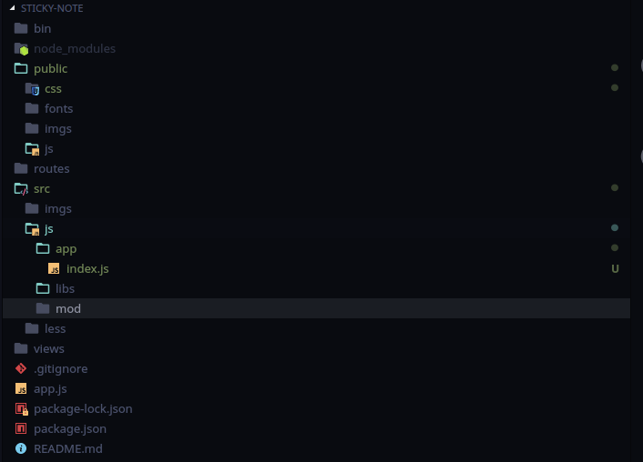

# 便利贴

## 技术栈

express less webpack jQuery

## 项目初始化

### 版本
镜像等(要安装 `nrm` 使用 `nrm use` 切换)

```shell
$ node -v
v9.5.0
$ npm -v
6.2.0
$ nrm  ls

  npm ---- https://registry.npmjs.org/
  cnpm --- http://r.cnpmjs.org/
* taobao - https://registry.npm.taobao.org/
  nj ----- https://registry.nodejitsu.com/
  rednpm - http://registry.mirror.cqupt.edu.cn/
  npmMirror  https://skimdb.npmjs.com/registry/
  edunpm - http://registry.enpmjs.org/

```

### [安装 `Express`](http://expressjs.com/zh-cn/)

```shell
npm init -y
npm i express --save
```

### [`Express` 应用程序生成器](http://expressjs.com/zh-cn/starter/generator.html)

```shell
npm install express-generator --save-dev  ./node_modules/express-generator/bin/express-cli.js  -f -e .
npm i
npm start
```

这样打开 `http://127.0.0.1:3000` 项目就已经初始化成功了。

### [中间件](http://expressjs.com/zh-cn/guide/using-middleware.html)

## `Webpack` 配置

### 完善文件目录



### [引入 `Webpack`](https://www.webpackjs.com/guides/installation/#%E5%89%8D%E6%8F%90%E6%9D%A1%E4%BB%B6)

```shell
npm i webpack --save-dev 
npm i webpack-cli --save-dev
```

为了测试我们的 `webpack` 能否正常的运行我们先简单试下功能

#### `src/js/app/index.js`

```javascript
var obj = require('../mod/b.js')
console.log(obj)
```
#### `src/js/mod/a.js`

```javascript
module.exports.a = 'aaaaaa'
```
#### `src/js/mod/b.js`

```javascript
var a = require('./a.js').a
module.exports = {
  a: a,
  b: 'bbbbb'
}
```
#### `webpack.config.js`
```javascript
const path = require('path');

module.exports = {
  mode: 'development',//代码不进行压缩还有生产环境
  entry: './src/js/app/index.js',//入口
  output: {//出口
    filename: 'index.js',
    path: path.resolve(__dirname, 'public/js')
  }
};
```

然后在命令行运行可以看到

#### shell

```shell
npx webpack --config webpack.config.js 
Hash: cb77b25fdba0777b168c
Version: webpack 4.16.5
Time: 85ms
Built at: 2018-08-14 16:23:39
   Asset      Size  Chunks             Chunk Names
index.js  4.58 KiB    main  [emitted]  main
Entrypoint main = index.js
[./src/js/app/index.js] 50 bytes {main} [built]
[./src/js/mod/a.js] 28 bytes {main} [built]
[./src/js/mod/b.js] 69 bytes {main} [built]

```

运行无误

### 使用 NPM 脚本 `NPM Scripts`

#### `package.json`

```javascript
  "scripts": {
    "start": "node ./bin/www",
+   "build": "webpack"
  },
```

#### shell

```shell
 npm run build  

> sticky-note@0.0.0 build /home/marsorsun/Desktop/repo/sticky-note
> webpack

Hash: cb77b25fdba0777b168c
Version: webpack 4.16.5
Time: 88ms
Built at: 2018-08-14 16:42:48
   Asset      Size  Chunks             Chunk Names
index.js  4.58 KiB    main  [emitted]  main
Entrypoint main = index.js
[./src/js/app/index.js] 50 bytes {main} [built]
[./src/js/mod/a.js] 28 bytes {main} [built]
[./src/js/mod/b.js] 69 bytes {main} [built]

```

## 组件 `Toast`

### `src/js/mod/toast.js`

```javascript
require('less/toast.less')

function toast(msg, time) {
  this.msg = msg
  this.dismissTime = time || 1000
  this.createToast()
  this.showToast()
}

toast.prototype = {
  createToast() {
    var template = `<div class="toast"> ${this.msg} </div>`;
    this.$toast = $(template)
    $('body').append(this.$toast)
  },
  showToast() {
    this.$toast.fadeIn(300, () => {
      setTimeout(() => {
        this.$toast.fadeOut(300, () => {
          this.$toast.remove()
        })
      }, this.dismissTime)
    })
  }
}

function Toast(msg, time){
  return new toast(msg, time)
}

module.exports.Toast = Toast
```


### 继续调整 `webpack` 配置

#### loader

由于我们使用了 `Less` 所以要使用 `loader` 使用前需要在 `shell` 

```shell
npm i style-loader css-loader less-loader less --save-dev
```

再来更改 `webpack.config.js`

```JavaScript
  module: {
    rules: [{
      test: /\.less$/,//匹配所有的后缀为 less 的文件
      use: ['style-loader', 'css-loader', 'less-loader']
    }]
  },
```
#### 自动更新
我们肯定不希望每一次更改下文件就要去手动重新输入 `npm run bulid` 我们需要 `--watch` 的功能，调整下 `package.json`

```JavaScript
  "scripts": {
    "start": "node ./bin/www",
    "build": "webpack --config webpack.config.js",
    "bw": "webpack --config webpack.config.js -w",
  },
```

#### resolve
当我们每次去输入文件路径是肯定会抱怨文件名又臭又长，我们很希望能用短的东西来代替长的东西，没关系 `webpack` 早就想到了。我们只需要把常用到的路径名在其中配置好。

```JavaScript
  resolve: {
    alias: {
      jquery: path.join(__dirname, "./src/js/libs/jquery-2.0.3.min.js"),
      mod: path.join(__dirname, "./src/js/mod"),
      less: path.join(__dirname, "./src/less/")
    }
  },
```

下次用的时候就不需要带上前面的一堆东东了，就可以像我上面写的

```JavaScript
require('less/toast.less')
```

非常便捷

#### plugins

向 `jQuery` 这种经常用到的框架，我不希望我在每个页面不停地去引用它，那有没有好点的方式能让我到处都能用又不去声明引用呢?那就可以在 `webpack` 给你准备的 `plugins`
```JavaScript
  plugins: [
    new webpack.ProvidePlugin({
      $: "jquery"
    }),
  ]
```

就可以像我在上面代码那样随意使用 `jQuery`

```javascript
$('body').append(this.$toast)
```

## 组件 `EventHub`

```javascript
var EventHub = (function () {
  var events = {}
  //订阅
  function on(eventName, handler) {
    events[eventName] = events[eventName] || []
    events[eventName].push({
      handler
    })
  }
  //发布
  function emit(eventName, args) {
    if (!events[eventName]) {
      return
    }
    for (let i = 0; i < events[eventName].length; i++) {
      events[eventName][i].handler(args)
    }
  }

  return {
    on,
    emit
  }
})()

module.exports = EventHub
```

使用发布订阅模式

## 组件 `Waterfall`

```javascript
var WaterFall = (function () {
  var $ct
  var $items

  function render($c) {
    $ct = $c
    $items = $ct.children()
    var nodeWidth = $items.outerWidth(true)
    var colNum = parseInt($(window).width() / nodeWidth)
    var colSumHeight = []
    for (let i = 0; i < colNum; i++) {
      colSumHeight.push(0)
    }
    $items.each(function () {
      var $cur = $(this)
      var index = 0
      var minSumHeight = colSumHeight[0]
      for (let i = 0; i < colSumHeight.length; i++) {
        if (colSumHeight[i] < minSumHeight) {
          index = i
          minSumHeight = colSumHeight[i]
        }
      }
      $cur.css({
        left: nodeWidth * index,
        top: minSumHeight
      })
      colSumHeight[index] = $cur.outerHeight(true)
    })
    $(window).on('resize', function(){
      render($ct)
    })
    return {
      init: render
    }
  }
})()

module.exports = WaterFal
```

`js` 实现瀑布流

## 组件 `Note`


[TOC]

